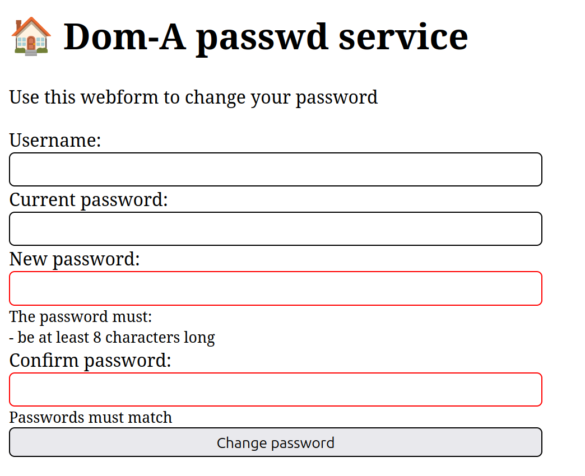

# LDAP passwd



A small web utility to modify user's password in LDAP directory service. It checks if the user exists in the directory under specified `dn` and, if the attempted bind was successful, attempts to modify its password.

## Getting started

It is recommended to use docker for deployment.
```bash
$ docker build -t ldap-passwd .
```

An example of running the container and binding the web service to port 80:
```bash
$ docker run -p 80:8000 -e LDAP_HOST=127.0.0.1 -e LDAP_PORT=389 -e USER_BIND_TMPL="uid=%s,ou=people,dc=example,dc=ee" ldap-passwd
```

Environment variables for configuration:
- `LDAP_HOST` - LDAP server hostname
- `LDAP_PORT` - LDAP server port to use
- `USER_BIND_TMPL` - distinguished name (`dn`) template for the user
